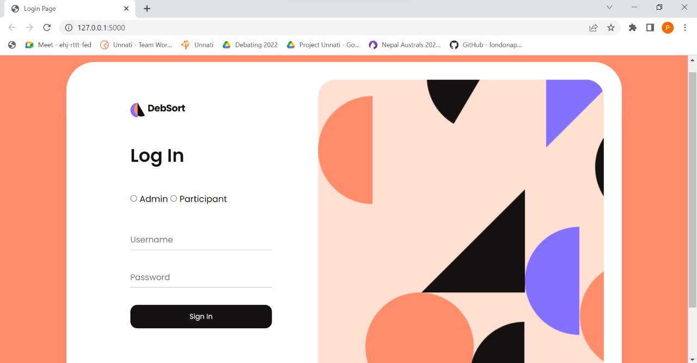
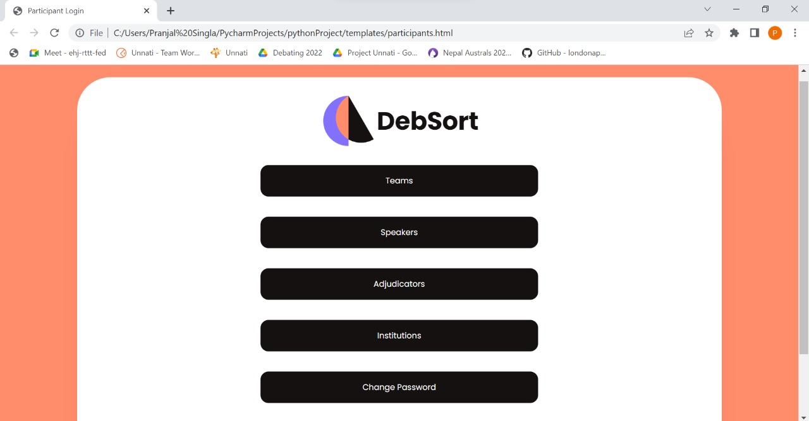
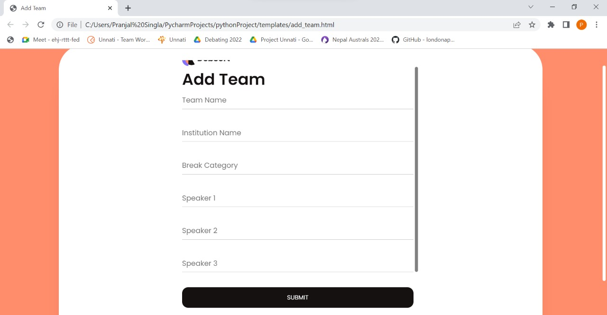

# DebSort

</img>
</img>
</img>

## 📓 Problem Statement
- With more than 100 colleges and more than 500 speakers and adjudicators, it becomes difficult to organize a debating tournament.
- There is a need for a platform to solve the problem of facilitating/managing the tournament, displaying participating institutions, Speakers, Adjudicators, and other relevant information.

## 🟢 Innovative Idea
- The platform that we have caters to all these issues.
- The platform allows users to edit/update/delete/view the relevant information, the necessary and backend data is abstracted and can be viewed and edited by the admin(Organising Team) only.

## 💻 Tech Stack used
- **MySQL** - We have used MySQL to create a database, store data, edit/update/delete
- **Flask** - We have used Flask which is a python library to integrate the front-end with MySQL
- **HTML, CSS, JavaScript** - Created beautiful UI using these languages

## ✨ Features
- **Login** - Allows users to Log In
- **View/Edit/Delete Data** - Allows users to edit/view/delete insitutions, teams, speakers, adjudicators and users etc.
- **Change Password** - Allows users to change password

## ❓ Future Prospects
- We aim to produce a commercial application.
- **Scalability**: - Provide our services to other institutions through this platform.
- **Premium**: - Provide the essential features to everyone for free, including certain features restricted to premium membership.
### Features include:
- A Draw generator.
- A Private ID(URL) generator.
- Accommodation of the CSV file to add data to the backend directly.
